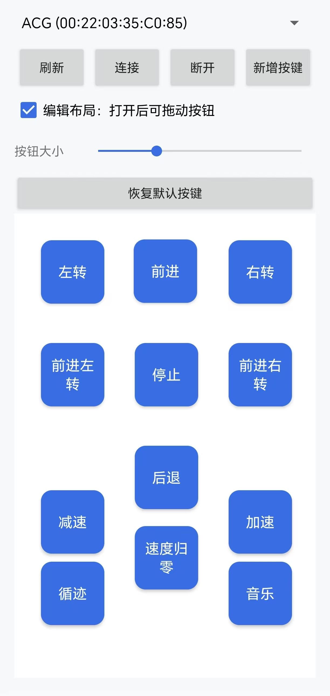

# Android Car Controller

这是一个用于 8051 智能小车的 Android 蓝牙控制软件。手机通过经典蓝牙 SPP 连接 HC-05 / HC-06 这类串口蓝牙模块，然后发送单字节 ASCII 指令给单片机。

## 软件界面



## 功能

- 连接手机系统里已经配对的经典蓝牙串口设备。
- 通过 Android 按钮控制小车运动、循迹、音乐和速度。
- 方向类按钮是点动控制：按下发送对应命令，松开发送 `S` 停止。
- 功能类按钮按下时只发送一次，例如停止、循迹、音乐、加速、减速、速度归零。
- 支持编辑按钮布局、拖动按钮位置、调整按钮大小。
- 支持新增、编辑、删除按钮，并配置按钮文字、发送字符和是否点动。
- 按钮配置会保存在手机本地。

## 项目结构

```text
.
|-- app/                         Android app 模块
|   |-- build.gradle.kts          app 模块 Gradle 配置
|   `-- src/main/
|       |-- AndroidManifest.xml   蓝牙权限和 app 入口
|       |-- java/com/ajddwbo/carcontroller/MainActivity.kt
|       |                         主界面、蓝牙连接、按钮配置、按钮发送逻辑
|       `-- res/                  字符串、样式、按钮背景等资源
|-- ref/
|   `-- main.c                    8051 单片机参考代码
|-- docs/images/app-screen.jpg    app 界面截图
|-- build.gradle.kts              项目级 Gradle 配置
|-- settings.gradle.kts           Gradle 模块配置
|-- gradle.properties             Gradle 属性
|-- gradlew / gradlew.bat         Gradle wrapper 启动脚本
|-- agent.md                      给后续开发/AI agent 的项目说明
`-- .gitignore                    GitHub 上传时忽略本地缓存和构建产物
```

## 开发环境

- Android Studio
- JDK 17
- Android Gradle Plugin 8.7.3
- Kotlin 2.0.21
- compileSdk 35
- minSdk 23
- targetSdk 35

如果 Android Studio 同步失败，先检查：

```text
Settings -> Build, Execution, Deployment -> Build Tools -> Gradle -> Gradle JDK
```

这里应选择 JDK 17，例如 `ms-17`。

## 运行方式

1. 用 Android Studio 打开本项目文件夹。
2. 用 USB 连接 Android 手机。
3. 手机打开开发者模式和 USB 调试。
4. 手机系统蓝牙里先配对 HC-05 / HC-06。
   - 常见配对码：`1234` 或 `0000`
5. 在 Android Studio 顶部选择手机设备。
6. 点击 Run 安装到手机。
7. 在 app 里点击“刷新”，选择已配对蓝牙模块，点击“连接”。

Android Studio Run 安装到手机后，拔掉 USB 也可以继续使用。Debug 版本适合自己测试和使用。


1. 打开手机蓝牙。
2. 在系统蓝牙里先配对小车蓝牙模块。
3. 打开 app，点击“刷新”。
4. 选择蓝牙设备，点击“连接”。
5. 按控制按钮发送命令。


## 蓝牙协议

app 使用经典蓝牙 SPP UUID：

```text
00001101-0000-1000-8000-00805F9B34FB
```

Android 端每次只发送一个 ASCII 字符。单片机端在 `ref/main.c` 中通过串口接收并处理命令。

| 命令 | Android 按钮 | 单片机行为 |
| --- | --- | --- |
| `F` | 前进 | 前进，松手后 app 发送 `S` 停止 |
| `B` | 后退 | 后退，松手后 app 发送 `S` 停止 |
| `L` | 左转 | 原地左转，松手后 app 发送 `S` 停止 |
| `R` | 右转 | 原地右转，松手后 app 发送 `S` 停止 |
| `Q` | 前进左转 | 左轮停、右轮前进，实现前进左转 |
| `E` | 前进右转 | 左轮前进、右轮停，实现前进右转 |
| `S` | 停止 | 停车并退出手动/循迹运动状态 |
| `A` | 循迹 | 进入自动循迹模式 |
| `M` | 音乐 | 播放或停止蜂鸣器音乐 |
| `+` | 加速 | 减少直行/转向暂停时间，提高速度 |
| `-` | 减速 | 增加直行/转向暂停时间，降低速度 |
| `0` | 速度归零 | 恢复默认速度参数 |

新增按钮时，Android 可以发送你填写的字符，但单片机必须在 `ref/main.c` 里支持这个字符，否则小车不会有动作。

## 按钮配置

默认按钮定义在 `MainActivity.kt` 的 `defaultControls` 列表中：

```kotlin
Control("f", "F", "前进", true, 135, 30)
```

参数含义：

```text
Control("按钮唯一 id", "发送字符", "按钮文字", 是否点动, 默认 X, 默认 Y)
```

`true` 表示这是点动按钮：按下发送对应命令，松开发送 `S`。  
`false` 表示这是一次性按钮：按下只发送一次命令，松开不额外发送 `S`。

app 会把按钮列表保存成 JSON，保存内容包括：

```text
id, command, label, momentary, x, y
```

所以用户在手机里新增、删除、编辑、拖动按钮后，关闭 app 再打开也会保留。点击“恢复默认按键”会清空当前自定义配置，并恢复 `defaultControls`。

## 主要代码位置

- 修改界面、按钮、蓝牙逻辑：`app/src/main/java/com/ajddwbo/carcontroller/MainActivity.kt`
- 修改按钮样式：`app/src/main/res/drawable/control_button.xml`
- 修改 app 名称：`app/src/main/res/values/strings.xml`
- 修改蓝牙权限：`app/src/main/AndroidManifest.xml`
- 修改单片机收到命令后的动作：`ref/main.c`

Android 发送命令的核心逻辑在 `MainActivity.kt`：

```kotlin
stream.write(command.toByteArray(Charsets.US_ASCII))
stream.flush()
```

单片机接收命令的核心逻辑在 `ref/main.c`：

```c
bluetooth_cmd = SBUF;
bluetooth_cmd_ready = 1;
```

单片机处理命令的核心逻辑在 `handle_bluetooth_cmd()`，手动运动持续执行的逻辑在 `manual_drive_step()`。

## GitHub 备份说明

本仓库应该上传源码、Gradle wrapper、`ref/main.c`、截图和文档。

不要上传以下内容：

- `build/`
- `.gradle/`
- `.idea/`
- `local.properties`
- `app/release/`
- APK、AAB、日志、签名文件
- `.jks`、`.keystore`、`keystore.properties`、`signing.properties`

这些内容已经写入 `.gitignore`。